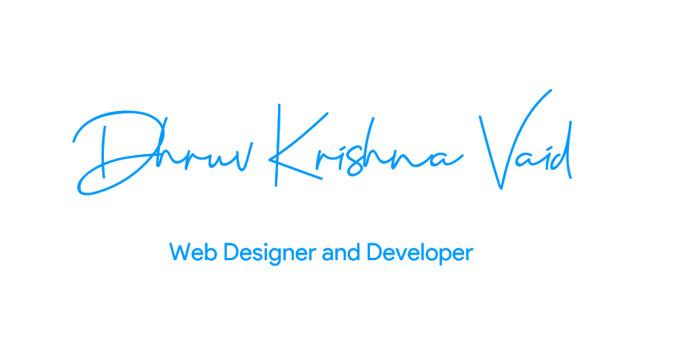

    
    

    
    

## Hi there! 

-   🌱 Learning more about and studying: **NodeJS**.
-   💙 Interests: games 👾, watching movies🎬, searching useless things on <a href="https://www.google.com/" style="text-decoration:none"><strong>Google</strong></a>
- ⚡ Fun fact: I'm a school boy who is currently in Class 9th !

### Languages and Tools

 

  
  
  
  
  
  

